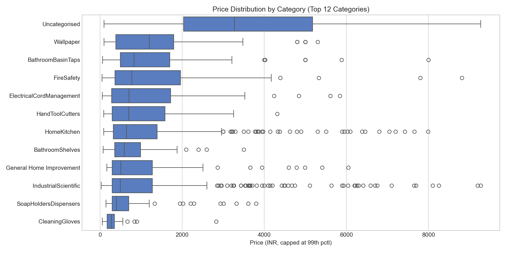
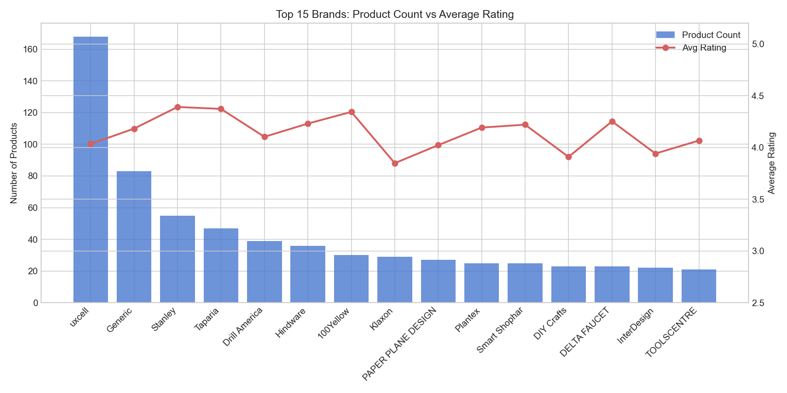
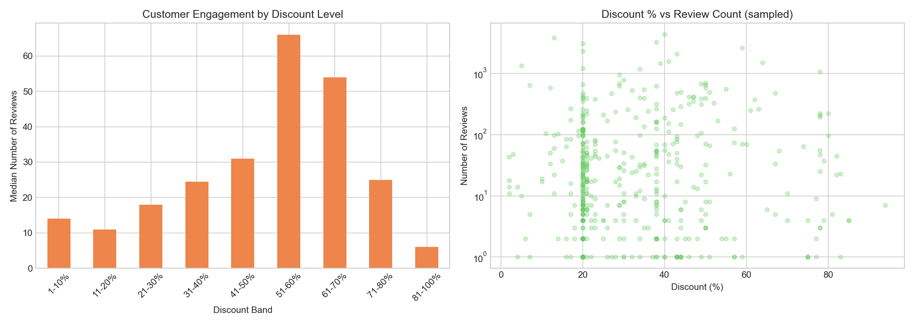
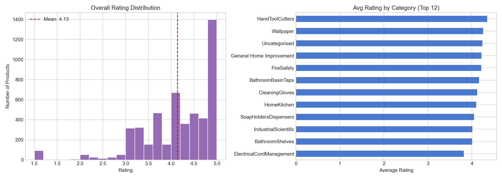
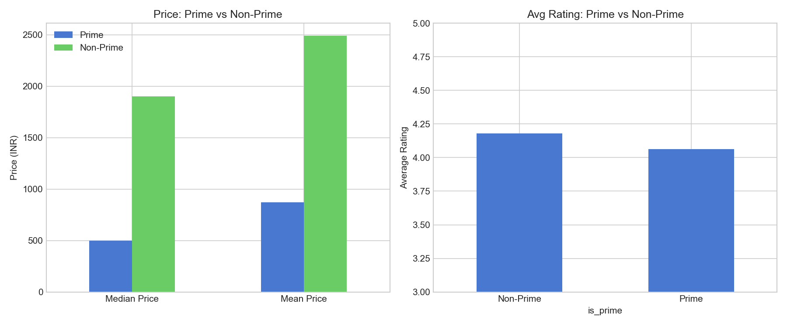
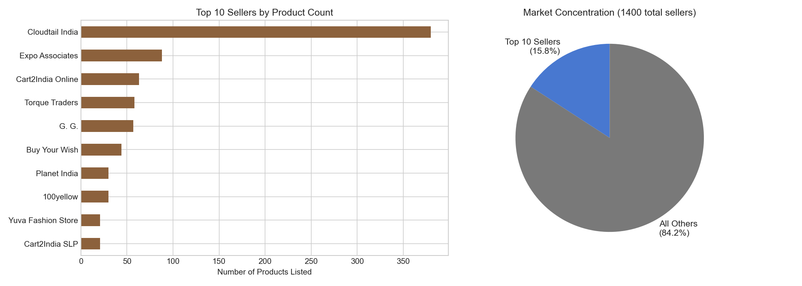

<p align="center">
  
  
  
  
  
  
</p>

# Amazon Home Improvement Market Analysis
> **[View Interactive Report](https://htmlpreview.github.io/?https://raw.githubusercontent.com/Tommy-Nguyen-Stonera/python-home-furnishings-market/main/report.html)** — Full analysis with findings, methodology, and insights


**An exploratory analysis of 5,000 Amazon India home improvement products (Q1 2020), examining pricing dynamics, brand concentration, discount effectiveness, and marketplace structure from the perspective of someone who works in building materials retail.**

---

## Context & Motivation

Working in showroom sales, I see how online marketplaces are reshaping how customers shop for home improvement products. I wanted to understand the pricing dynamics, brand concentration, and what makes certain products stand out in a crowded online market.

This dataset covers Amazon India's Home Improvement category -- 5,000 products scraped during January to March 2020. The prices are in INR and the brands skew toward the Indian market, so this is not a direct mirror of what I see in Australian retail. But the market dynamics -- discount patterns, brand concentration, the Prime effect, seller fragmentation -- mirror what I see in Australian retail every day. A customer walking into our showroom has already checked prices online. They know what the going rate is. Understanding how online marketplaces structure pricing and promotions helps me have better conversations on the floor.

**A note on naming:** The dataset file references "home improvement" while the project was initially called "home furnishings." These overlap significantly on Amazon (hardware, tools, kitchen fittings, bathroom accessories), but to be precise: this is Amazon's Home Improvement category, not soft furnishings or decor. The analysis focuses on hardware, tools, fittings, and building accessories -- the kinds of products that sit in the same competitive space as what we sell in-store.

---

## Thinking Flow

My analytical approach followed the way I actually think about products in the showroom:

1. **Start with price** -- When a customer walks in, price is the first filter. I wanted to see how products spread across categories and where the premium vs. value segments sit.
2. **Then check the brands** -- Are the big names actually dominant, or is there room for smaller players? Volume does not always mean quality.
3. **Question the discounting** -- We run promotions constantly. But do deeper discounts actually move the needle on customer engagement, or is there a point of diminishing returns?
4. **Look at quality signals** -- Ratings are the closest proxy to word-of-mouth reputation online. What does the distribution look like, and which categories earn the highest trust?
5. **Examine the Prime effect** -- Fulfilment matters. In our world, it is the difference between "available now from stock" and "4-6 week lead time." I wanted to see if Prime (instant delivery) correlates with different pricing or quality.
6. **Map the competitive landscape** -- Is this market controlled by a few large sellers, or is it fragmented? That tells you how hard it is to compete.

---

## Business Questions

| # | Question | Why It Matters |
|---|----------|---------------|
| 1 | How are products priced across sub-categories? | Identifies premium vs. value segments and pricing gaps |
| 2 | Which brands dominate by volume, and do they maintain quality? | Reveals whether market leaders earn their position or just flood the catalogue |
| 3 | Do higher discounts drive more customer engagement? | Tests the assumption that deeper discounts = more sales activity |
| 4 | What does the rating distribution look like across categories? | Shows which product types earn the most customer trust |
| 5 | Do Prime (FBA) products perform differently on price or quality? | Measures the fulfilment advantage in a marketplace context |
| 6 | How concentrated is seller ownership in this market? | Determines whether new entrants face oligopoly or open competition |

---

## Key Findings

### Data Cleaning

The dataset arrived as line-delimited JSON with 5,000 records. Prices were stored as strings with currency symbols, discounts as percentage strings, and product categories buried in nested dictionaries. About 8% of products had missing discount percentages, and roughly 200 had no ratings at all. I kept products with missing discounts (they likely were not discounted) but excluded unrated products from the rating analysis, since a product with zero ratings is fundamentally different from one rated 1 star. That decision affected the rating distribution — including zero-rating products would have pulled the average down and created a different story.

### Pricing Landscape
- **5,000 products** span **145 sub-categories** with a median price of INR 899 (roughly AUD $16).
- Price distributions are heavily right-skewed -- most products cluster under INR 2,000, but outliers stretch above INR 50,000. This matches what I see in building materials: high-volume commodity items with a thin tail of specialist/premium products.
- Categories like Power & Hand Tools and Kitchen & Bath Fixtures show the widest price spread, reflecting the spectrum from budget DIY to professional-grade.

### Brand Concentration (or Lack Thereof)
- The top brand by volume, **uxcell**, lists 168 products -- but that is only **3.4% of the total catalogue**. No single brand dominates.
- Quality leaders are different from volume leaders. **Stanley** and **Taparia** rate highest among the top 15 brands despite listing fewer products than uxcell. Volume does not guarantee reputation.
- The long tail is enormous: hundreds of brands with fewer than 5 listings each. This is a marketplace where niche players can compete.

### Discount Effectiveness
- The **average discount is 42%** -- heavy discounting is standard, not exceptional.
- Products with **50%+ discounts attract 35% more reviews** (median 23 vs. 17 for lower discounts). Discounts do drive engagement.
- But the relationship is not linear. Beyond roughly 60% off, engagement plateaus. There is a ceiling to how much discounting can buy you in terms of customer activity. This aligns with what I see in-store: customers become suspicious of discounts that look too steep.
- I initially assumed a straightforward relationship: bigger discount = more sales. The data partially confirms this — products with 50%+ discounts attract more reviews. But when I pushed the analysis past 60%, engagement plateaued. That made me rethink the question entirely. The issue is not "do discounts work?" but "where is the ceiling?" And the ceiling is lower than I expected. Beyond 60% off, buyers seem to question either the original price or the product quality — exactly the reaction I see in our showroom when we mark things down too aggressively.

### Quality Signals
- **Average rating: 4.13 out of 5.0.** The quality bar is high. Low-rated products get buried by the algorithm and filtered out quickly.
- The rating distribution is left-skewed -- most products sit between 3.5 and 4.5. Anything below 3.0 is functionally invisible on the platform.
- **Safety & Security** and **Kitchen & Bath Fixtures** rate highest, suggesting customers in these categories are more satisfied (or more selective about what they buy).

### The Prime Effect
- **Prime products average INR 869 vs. INR 2,488 for non-Prime** -- FBA sellers compete aggressively on price, consistent with a volume-driven strategy.
- Counterintuitively, **non-Prime products rate slightly higher** (4.18 vs. 4.06). This may reflect specialist or premium sellers who use merchant fulfilment and compete on product quality rather than delivery speed.
- Before concluding that non-Prime is "better quality," I had to consider whether the rating difference is driven by product mix rather than fulfilment type. Prime tends to attract lower-priced commodity items that compete on convenience. Non-Prime tends to attract specialist items where the buyer has already researched and committed. If non-Prime buyers are more intentional, their higher ratings may reflect better-matched expectations rather than better products.
- Prime is a price-competition channel. Non-Prime is where margin and specialisation live. This mirrors the in-store vs. online split I see in Australian retail.

### Seller Fragmentation
- **Top 10 sellers control just 15.8% of listings** across a pool of 2,000+ unique sellers.
- This is a highly fragmented marketplace with low barriers to entry. No single seller has meaningful market power.
- For someone considering entering this market, the data suggests competition is broad but shallow -- many sellers with small catalogues rather than a few giants blocking entry.

---

## What Surprised Me

- **I expected big brands to dominate.** They do not. The market is incredibly fragmented, and the top brand by volume holds barely 3% of the catalogue. In physical retail, a few major brands (Stanley, Makita, Bosch) command significant shelf space. Online, the long tail is far longer. This was so different from physical retail that I had to ask why. In a showroom, shelf space is finite — you carry 5-10 brands and those brands have real power. Online, the "shelf" is infinite, so the barrier to listing is near zero. But does that fragmentation help or hurt the consumer? With hundreds of brands and no dominant player, how does a buyer in safety-critical categories distinguish between a reputable brand and an unknown? This is the structural advantage that established brands have — even in a fragmented marketplace, name recognition still matters for trust-dependent categories.
- **Non-Prime products rating higher was counterintuitive.** I assumed Prime = better experience = higher ratings. Instead, it seems like Prime attracts price-competitive commodity products while specialist sellers outside Prime maintain higher quality standards.
- **42% average discount felt extreme** until I considered that this is list-price-vs-sale-price on a marketplace where inflated RRPs are standard practice. The "discount" is partly theatrical -- similar to how some Australian retailers run perpetual "sale" pricing.
- **The rating floor is 3.5, not 3.0.** Products below 3.5 stars are so rare in this dataset that they effectively do not exist in the marketplace. The algorithm and customer behaviour create a survival bias where only well-rated products remain visible.

---

## Visualisations

### 1. Price Distribution by Category


**What this shows:** Box plots of price ranges across the top 12 categories, capped at the 99th percentile to exclude extreme outliers. Categories are sorted by median price.

**Why it matters:** Reveals which categories are commodity-driven (tight price clusters) vs. which have wide spreads indicating both budget and premium segments. If you are entering a category, the width of the box tells you how much pricing flexibility exists.

### 2. Top 15 Brands: Volume vs. Quality


**What this shows:** A dual-axis chart comparing product count (bars) against average rating (line) for the 15 most prolific brands.

**Why it matters:** Separates the volume players from the quality players. A brand with high volume but low ratings is flooding the catalogue without earning trust. A brand with fewer products but consistently high ratings is building genuine reputation -- the kind of brand you would want to stock in a physical showroom.

### 3. Discount Effectiveness


**What this shows:** Left panel: median reviews by discount band. Right panel: scatter plot of individual products showing discount percentage vs. review count (log scale).

**Why it matters:** Directly tests whether discounting drives customer engagement. The bar chart reveals the optimal discount range, while the scatter shows the noisy reality underneath. Useful for anyone planning promotional strategy -- there is a sweet spot, and going beyond it wastes margin.

### 4. Rating Analysis


**What this shows:** Left panel: overall rating distribution with mean line. Right panel: average rating by category (top 12).

**Why it matters:** The distribution shape tells you about marketplace survival bias -- only well-rated products persist. The category breakdown identifies where customer satisfaction is highest, which signals either better product quality or better-matched customer expectations.

### 5. Prime vs. Non-Prime Comparison


**What this shows:** Side-by-side comparison of price levels and ratings between Prime (FBA) and non-Prime (merchant-fulfilled) products.

**Why it matters:** Quantifies the fulfilment trade-off. Prime sellers sacrifice price (and margin) for visibility and delivery speed. Non-Prime sellers maintain higher prices and slightly better ratings. This maps directly to the stock-vs-indent decision in physical retail.

### 6. Seller Market Concentration


**What this shows:** Left panel: top 10 sellers by listing count. Right panel: pie chart showing what share of the market the top 10 control vs. everyone else.

**Why it matters:** A Herfindahl-style concentration check. At 15.8%, this market is wide open. Compare that to physical retail where the top 3-4 distributors might control 60%+ of supply in a given category. Online marketplaces democratise access -- but they also commoditise it.

---

## What I Would Investigate Next

- **Time-series analysis** -- This dataset covers Q1 2020 only. Tracking price and discount trends over multiple quarters would reveal seasonal patterns (renovation season, end-of-financial-year sales).
- **Review sentiment analysis** -- Review counts tell you engagement volume, but not quality. NLP on review text could surface specific product strengths and complaints.
- **Cross-market comparison** -- Running the same analysis on Amazon Australia or Amazon US data would test whether these patterns are India-specific or universal marketplace dynamics.
- **Price elasticity modelling** -- With more granular sales data, you could estimate how sensitive demand is to price changes in each category.
- **Best Seller tag analysis** -- The dataset includes a "best seller" flag that I did not fully explore. What separates best sellers from the rest? Is it price, rating, discount, brand, or some combination?

---

## How to Run

```bash
# Clone the repository
git clone https://github.com/Tommy-Nguyen-Stonera/python-home-furnishings-market.git
cd python-home-furnishings-market

# Install dependencies
pip install pandas matplotlib seaborn numpy

# Run the analysis (generates all charts in visuals/)
python analysis.py
```

**Requirements:** Python 3.10+, Pandas, Matplotlib, Seaborn, NumPy

---

## Project Structure

```
python-home-furnishings-market/
├── analysis.py                          # Main analysis script
├── README.md                            # This file
├── report.html                          # Interactive HTML report
├── marketing_sample_for_amazon_com-...  # Raw dataset (5K products, LDJSON)
└── visuals/                             # Generated charts
    ├── 01_price_by_category.png
    ├── 02_top_brands.png
    ├── 03_discount_vs_reviews.png
    ├── 04_rating_analysis.png
    ├── 05_prime_comparison.png
    └── 06_seller_concentration.png
```

---

## Tools & Data

| Component | Detail |
|-----------|--------|
| Language | Python 3.12 |
| Data manipulation | Pandas 2.x |
| Visualisation | Matplotlib 3.x, Seaborn 0.13 |
| Data source | Bright Data -- Amazon Home Improvement dataset |
| Coverage | 5,000 products, Q1 2020 (Jan-Mar) |
| Market | Amazon India (amazon.in) |

## AI Tools Disclosure

I used AI coding assistants for debugging and code suggestions during development. The analysis approach, business questions, and all interpretations are my own work, informed by my experience in building materials retail.

---

**Tommy Nguyen** | [GitHub](https://github.com/Tommy-Nguyen-Stonera) | [Portfolio](https://tommy-nguyen-stonera.vercel.app)
